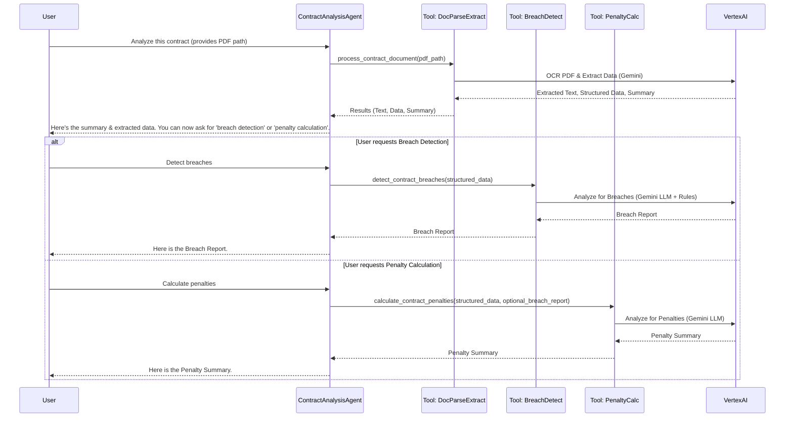

# Legal Contract Analysis Agent: Design & Implementation Plan

This plan outlines the development of a Google ADK-based agent that leverages Vertex AI for analyzing legal contracts.

**I. Core Objective & Features:**

The agent will assist users by:
1.  **Document Parsing & Initial Data Extraction:** Processing PDF contracts to extract text and key information (dates, parties, financial terms, etc.), and providing a summary.
2.  **Breach Detection:** Analyzing extracted data against predefined rules to identify potential contract breaches.
3.  **Penalty Calculation:** Calculating potential penalty amounts based on contract terms and identified breaches.

**II. Technical Stack:**

*   **Agent Framework:** Google ADK (Python)
*   **AI Services:** Google Vertex AI
    *   Gemini (for OCR/Document Parsing from PDF)
    *   Gemini (LLM for Data Extraction, Breach Detection, Penalty Calculation)
*   **Programming Language:** Python

**III. Agent Architecture & Components:**

We will design a main `ContractAnalysisAgent` that utilizes several specialized `Tools` (akin to sub-agents or services) for each core feature.

```mermaid
graph TD
    User -->|1. PDF Contract & Request| MainAgent(ContractAnalysisAgent)

    MainAgent -->|2. Process Contract| DPDE_Tool(Tool: DocumentParsingDataExtraction)
    DPDE_Tool -- PDF Path --> VertexAI_OCR(Vertex AI: Gemini for OCR)
    VertexAI_OCR -- Extracted Text --> DPDE_Tool
    DPDE_Tool -- Extracted Text --> VertexAI_LLM_Extract(Vertex AI: Gemini LLM for Extraction)
    VertexAI_LLM_Extract -- Structured Data, Summary --> DPDE_Tool
    DPDE_Tool -->|3. Summary & Extracted Data| MainAgent
    MainAgent -->|4. Present to User, Offer Next Steps| User

    User -->|5a. Request Breach Detection| MainAgent
    MainAgent -->|6a. Extracted Data| BD_Tool(Tool: BreachDetection)
    BD_Tool -- Extracted Data & Breach Rules --> VertexAI_LLM_Breach(Vertex AI: Gemini LLM for Breach Analysis)
    VertexAI_LLM_Breach -- Breach Report --> BD_Tool
    BD_Tool -->|7a. Breach Report| MainAgent
    MainAgent -->|8a. Present Breach Report| User

    User -->|5b. Request Penalty Calculation| MainAgent
    MainAgent -->|6b. Extracted Data, Breach Details (if any)| PC_Tool(Tool: PenaltyCalculation)
    PC_Tool -- Contract Terms, Breach Info --> VertexAI_LLM_Penalty(Vertex AI: Gemini LLM for Penalty Calc)
    VertexAI_LLM_Penalty -- Penalty Report --> PC_Tool
    PC_Tool -->|7b. Penalty Report| MainAgent
    MainAgent -->|8b. Present Penalty Report| User
```

**IV. Detailed Component Breakdown:**

1.  **`MainContractAgent` (ADK Agent)**
    *   **Description:** Orchestrates the contract analysis workflow, manages user interaction, and delegates tasks to specialized tools.
    *   **Instructions:** "You are an AI assistant for legal contract analysis. You will help users by parsing contracts, extracting key data, identifying potential breaches, and calculating penalties."
    *   **Model:** `gemini-pro` (or another suitable Gemini model via Vertex AI, configured in ADK).
    *   **Tools Registered:**
        *   `process_contract_document` (maps to `DocumentParsingDataExtractionTool`)
        *   `detect_contract_breaches` (maps to `BreachDetectionTool`)
        *   `calculate_contract_penalties` (maps to `PenaltyCalculationTool`)
    *   **Workflow:**
        1.  Receives a PDF contract file path from the user (e.g., via an initial prompt or a specific ADK invocation method).
        2.  Calls the `process_contract_document` tool.
        3.  Presents the summary and extracted data to the user.
        4.  Informs the user that they can now request "breach detection" or "penalty calculation."
        5.  Based on subsequent user requests, calls the appropriate tool (`detect_contract_breaches` or `calculate_contract_penalties`) with the necessary data (primarily the data extracted by `process_contract_document`).
        6.  Presents the results from these tools to the user.

2.  **`DocumentParsingDataExtractionTool` (ADK Tool / Python Function)**
    *   **Function Signature (Conceptual):** `def process_contract_document(pdf_file_path: str) -> dict:`
    *   **Description:** "Parses a PDF contract, extracts its text, identifies key data points, and provides a summary."
    *   **Steps:**
        1.  **Input:** `pdf_file_path` (string).
        2.  **Document Parsing (OCR):**
            *   Use Vertex AI Gemini's multimodal capabilities to process the PDF. This involves sending the PDF content (or a reference) to Gemini and requesting text extraction.
            *   Handle potential errors (e.g., file not found, PDF unreadable).
        3.  **Data Extraction (LLM):**
            *   Take the extracted text.
            *   Construct a prompt for a Vertex AI Gemini LLM. The prompt should instruct the LLM to:
                *   Extract key data points: effective dates, expiration dates, involved parties (names, roles, addresses, contacts), financial amounts/terms, specific conditions, renewal terms, termination clauses, penalty clauses, non-compliance mentions, governing law, etc.
                *   Attempt to determine if it can "fully extract the data to guarantee a minimum data quality" (e.g., by asking the LLM to list essential fields it found vs. expected, or provide a confidence assessment).
                *   Generate a concise summary of the contract.
            *   Call the Vertex AI LLM with this prompt.
        4.  **Output:** A dictionary containing:
            *   `status`: "success" or "error"
            *   `extracted_text`: Full text from the PDF.
            *   `structured_data`: A JSON-like object with the extracted key-value pairs.
            *   `summary`: The LLM-generated summary.
            *   `data_quality_assessment`: LLM's assessment of extraction completeness/quality.
            *   `error_message` (if status is "error").

3.  **`BreachDetectionTool` (ADK Tool / Python Function)**
    *   **Function Signature (Conceptual):** `def detect_contract_breaches(extracted_contract_data: dict) -> dict:`
    *   **Description:** "Analyzes extracted contract data against predefined rules to identify potential breaches."
    *   **Predefined Breach Rules (to be embedded in the LLM prompt):**
        1.  **Expiration Dates:** Contract must have an expiration date.
        2.  **Parties Involved:** Contract must involve at least two distinct parties.
        3.  **Financial Terms:** Contract should specify clear financial terms or considerations.
        4.  **Termination Clauses:** Contract should include clauses detailing termination conditions.
    *   **Steps:**
        1.  **Input:** `extracted_contract_data` (the `structured_data` output from `DocumentParsingDataExtractionTool`).
        2.  **Breach Analysis (LLM):**
            *   Construct a prompt for a Vertex AI Gemini LLM. The prompt should include:
                *   The `extracted_contract_data`.
                *   The predefined breach rules listed above.
                *   Instructions for the LLM to analyze the data against each rule and report whether the condition is met, not met (potential breach), or if data is insufficient to determine.
            *   Call the Vertex AI LLM.
        3.  **Output:** A dictionary containing:
            *   `status`: "success" or "error"
            *   `breach_report`: A structured report detailing the analysis for each rule (e.g., `{"rule": "Expiration Dates", "status": "Met/Not Met/Insufficient Data", "details": "..."}`).
            *   `error_message` (if status is "error").

4.  **`PenaltyCalculationTool` (ADK Tool / Python Function)**
    *   **Function Signature (Conceptual):** `def calculate_contract_penalties(extracted_contract_data: dict, breach_report: dict = None) -> dict:`
    *   **Description:** "Calculates potential penalty amounts based on contract terms and identified breaches."
    *   **Steps:**
        1.  **Input:**
            *   `extracted_contract_data` (from `DocumentParsingDataExtractionTool`, especially sections related to penalties).
            *   `breach_report` (optional, output from `BreachDetectionTool`, to provide context on specific breaches).
        2.  **Penalty Analysis (LLM):**
            *   Construct a prompt for a Vertex AI Gemini LLM. The prompt should instruct the LLM to:
                *   Review the `extracted_contract_data` for any clauses detailing penalties for non-compliance or specific breaches.
                *   If a `breach_report` is provided, focus on penalties related to those identified breaches.
                *   Identify and, if possible, quantify any penalty amounts or calculation formulas described.
                *   If direct calculation isn't possible, describe the nature of the penalties.
            *   Call the Vertex AI LLM.
        3.  **Output:** A dictionary containing:
            *   `status`: "success" or "error"
            *   `penalty_summary`: A report detailing potential penalties (e.g., `{"breach_type": "Late Delivery", "penalty_clause": "...", "calculated_amount": "...", "notes": "..."}` or a textual summary).
            *   `error_message` (if status is "error").

**V. User Interaction Flow (Conceptual):**



**VI. Implementation Notes:**

*   **Error Handling:** Each tool should implement robust error handling (e.g., for API failures, file issues, unexpected data).
*   **Prompt Engineering:** Significant effort will be required in crafting effective prompts for Vertex AI LLMs to ensure accurate data extraction, breach analysis, and penalty calculation. This will be an iterative process.
*   **Configuration:** API keys and other configurations for Vertex AI should be managed securely (e.g., environment variables, ADK configuration mechanisms).
*   **ADK Structure:** The Python code will be organized into modules for the main agent and each tool, following ADK best practices.
*   **Testing:** Unit tests for tools and integration tests for the overall agent flow will be crucial.

**VII. Next Steps:**

1.  **Environment Setup:** Set up a Python environment with Google ADK and Vertex AI SDK.
2.  **Iterative Development:**
    *   Start by implementing the `DocumentParsingDataExtractionTool`.
    *   Then, implement the `MainContractAgent` to orchestrate this first tool.
    *   Subsequently, develop `BreachDetectionTool` and `PenaltyCalculationTool`, integrating them one by one.
    *   Refine prompts and logic based on testing at each stage.